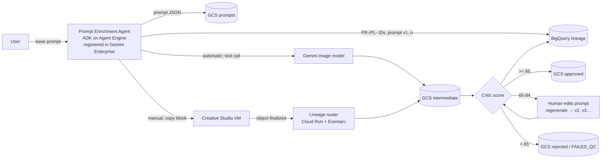

# Creative Asset Pipeline

A configurable, customer-agnostic GenMedia pipeline on Google Cloud:

**Prompt agent (Gemini Enterprise) → image generation (Creative Studio or automatic) → quality score → auto-approve / human revision / fail → GCS + BigQuery lineage.**

It implements SOW `SBD-GenMedia-Creative-Assets-2026` (sections 3.2, 3.4.1, 3.4.2 and 3.4.5) and `SBD_Creative_Studio_TDD_v0.2` (sections 5, 6, 7, 9 and 15). Everything customer-specific lives in one YAML file, so the same code runs for any customer.



## What gets recorded (BigQuery dataset `<customer>_cs_lineage`)

| Question | Where |
|---|---|
| Which user prompted what | `enriched_prompt.created_by`, `v_user_activity`, report `01_who_prompted_what` |
| Every prompt version per SKU | `enriched_prompt` (`prompt_lineage_id` + `prompt_version` + `parent_prompt_id`), `v_prompt_versions` |
| Which images each prompt produced | `generation` (`GEN-` ID, `version`, `prompt_id`, `parent_asset_id`) |
| Intermediate vs final outputs | `v_asset_lifecycle.output_stage` (INTERMEDIATE_SUPERSEDED / INTERMEDIATE_IN_PROGRESS / FINAL_APPROVED / FINAL_REJECTED) |
| Scores and rationale | `score` (composite, 4 sub-scores, hallucination risk and band, tier, rationale, weights and thresholds used) |
| Edit log | `edit_event` (REGISTER, REVISE_PROMPT, REGENERATE, APPROVE, REJECT, and who did each) |
| Final disposition | `disposition` (append-only; latest row = current status, `v_current_status`) |
| Full provenance of a source asset | `v_provenance`, report `05_provenance_for_parent` |

All tables are append-only. Superseded versions are kept, never overwritten.

**GCS layout.** Every image version goes to `-intermediate`. When an image reaches a final decision it's copied to `-approved` or `-rejected` with the scoring payload embedded as a PNG `gcc_scoring_payload` chunk. The audit package JSON goes to the write-once `-audit` bucket. Every object carries lineage metadata: `batch-run-id`, `generation-id`, `prompt-id`, `composite-score`, `status`, `ai-generated`, and so on.

## Routing rules (all configurable in `scoring.thresholds`)

| Composite score | Status | What happens |
|---|---|---|
| ≥ `auto_approve_min` (85) | APPROVED | Auto-approved and copied to the approved bucket. A HIGH hallucination risk overrides this and flags the image for review (`high_hallucination_blocks_auto_approve`). |
| ≥ `revision_min` (65) | NEEDS_REVISION | A human edits the prompt (`revise_prompt` in the agent or `cap hitl revise`), which creates a new prompt version and regenerates the image as v n+1, which is scored again. The human can also approve as-is or reject. |
| < `revision_min` | FAILED_QC (default) or FLAGGED | Set by `below_revision_action: FAIL` or `FLAG_FOR_HITL`. The SOW text says "Flagged for HITL"; the current default is FAIL. |

Hallucination risk = critic value, or `(1 − artifact_freedom) × 100` (TDD ADR-06). Bands: > 60 HIGH, > 30 MEDIUM.

## Agent runtime: personal dev vs customer Gemini Enterprise

`agent_runtime` in the YAML decides where the prompt agent runs. The tools, IDs and BigQuery records are the same in all three modes, so what you test in dev is what the customer gets.

| `agent_runtime` | Use for | How users reach it | Hosting cost |
|---|---|---|---|
| `local` | Development on your own machine | `cap agent web` (ADK dev UI at http://localhost:8000) or `cap agent chat` | None. You pay only for Gemini tokens and BigQuery/GCS usage. |
| `cloud_run` (SBD dev default) | Development with the agent hosted in the project | `cap agent open` (authenticated proxy to http://localhost:8000; the service is private) | Cloud Run pay per request; scales to zero, so no traffic costs nothing. Sessions reset when it scales down; lineage is in BigQuery. |
| `agent_engine` | Testing the deployed agent without Gemini Enterprise | `cap agent chat` (or the Agent Engine API) | Pay per use: $0.085/vCPU-hour + $0.009/GiB-hour, with a monthly free tier of 50 vCPU-hours / 100 GiB-hours |
| `gemini_enterprise` (customer template default) | Customer environments | Licensed users chat in their Gemini Enterprise app | Agent Engine cost plus Gemini Enterprise seats: Business from $21, Standard from $30 per user per month (SBD's order form: Plus at $50 × 150 seats) |

In `local` mode, prompts are recorded as created by your gcloud account. In `gemini_enterprise` mode they're recorded as the signed-in Gemini Enterprise user.

## Generation step: manual (default) or automatic

`generation.mode` in the YAML:

- **manual:** the agent saves the prompt and shows a copy block (Prompt ID, folder, model, resolution, reference images, prompt text). The user pastes it into Creative Studio. The lineage router links each new Creative Studio image back to its prompt in this order: a Prompt ID in the path or metadata, then the prompt hash, then an unambiguous batch/SKU folder. Anything unmatched is quarantined for `cap image link`. As a fallback, images can be uploaded with `cap image register <PR-id> file.png` or dropped into `gs://<prefix>-intermediate/inbox/<PR-id>/`.
- **automatic:** the agent's `save_enriched_prompt` tool calls the Gemini image model directly, writes the variants to the intermediate bucket, and scores and routes each one.

## Prerequisites (one time)

```bash
brew install terraform
cd code/creative-asset-pipeline
python3 -m venv .venv && .venv/bin/pip install -e ".[gcp,agent,router,dev]"
gcloud auth login                                  # the gcp.admin_account in the YAML
gcloud auth application-default login              # for the Python SDKs and Terraform
```

You also need:
- A billing account ID (`gcloud billing accounts list`).
- Only for `agent_runtime: gemini_enterprise` (customer environments): a Gemini Enterprise app created in the console. Put its ID in `gemini_enterprise.app_id`. Dev on a personal account doesn't need one.

## Creative Studio (GCC) deployment

`creative_studio.deployment` in the YAML: `cloud_run` (default), `vm` or `none`.

**Artifact Registry cleanup.** `storage.container_images_keep: 5` (our `cap` repo) and GCC `developlocal`'s `image_keep_count = 5` (backend repo) delete images older than 1 day, except the 5 most recent.

**SBD dev uses the fork branch `developlocal`** (https://github.com/kbhanoji/gcc-creative-studio, see `DEVELOPLOCAL.md` there). It is `develop` plus:
- the backend scales to zero (`be_min_instances = 0`)
- the backend **starts a stopped Cloud SQL database on the first request** (the frontend retries while it starts, so there's no manual `cap gcc wake`)
- a smaller dev database by default: `db-custom-1-3840` on Enterprise edition, ~$50/month at 24/7 instead of ~$185
- Artifact Registry image cleanup Stopping is still done by `cap gcc schedule` (17:00) or `cap gcc sleep`.

**Installing GCC:** follow [docs/gcc-install-runbook.md](docs/gcc-install-runbook.md). It lists every installer question with the answer and the reason.

**Which GCC branch.** `creative_studio.branch_by_environment` maps `dev → develop`, `uat → test`, `prod → main`. `repo_ref` overrides it with a branch, tag or commit; pin a commit for enterprise/prod (TDD ADR-10). `cap gcc install` runs the bootstrap from that ref. When you fork, untick "Copy the main branch only" on GitHub so `develop` and `test` exist in your fork.

With **`cloud_run`**, Creative Studio is installed with Google's own `bootstrap.sh` into the same project. It is **not** fully pay-per-use on any branch. On Sep 25, 2026 the infrastructure Terraform and `bootstrap.sh` were **identical** on `main` (`1f19478`, Sep 2), `develop` (`5e1c7c9`, Sep 17) and `test` (`96a6173`, Aug 13):

| GCC component | Idle behaviour | Rough idle cost |
|---|---|---|
| Frontend on Firebase Hosting | Static hosting | ~$0 (free tier) |
| Backend on Cloud Run (2 vCPU, 2 GiB) | `scaling_min_instances = 1`: one instance always kept warm | ~$25/month (estimate) |
| Cloud SQL PostgreSQL 18, tier `db-perf-optimized-N-2` (Enterprise Plus, 2 vCPU / 16 GB) | Runs 24/7 | ~$185/month |
| GCS media bucket, Cloud Build, Secret Manager | Usage-based | Cents |
| Imagen / Veo / Gemini calls | Pay per generation | Per use |

To make dev cheaper:
- Stop the database when you aren't using it, by hand or on a schedule. See [Stopping and starting the Creative Studio database](#stopping-and-starting-the-creative-studio-database-development).
- For a permanently cheaper dev setup, edit your GCC fork before running bootstrap. In `infra/modules/platform/main.tf`, set `scaling_min_instances = 0`. In `infra/modules/postgresql/main.tf`, change the tier to a small Enterprise-edition machine (e.g. `edition = "ENTERPRISE"`, `tier = "db-custom-1-3840"`, about $50/month). Otherwise GCC's own Terraform restores its settings on its next apply.

### Stopping and starting the Creative Studio database (development)

GCC's Cloud SQL database is its biggest cost (~$185/month if it runs 24/7). While it's stopped you pay only for its disk (a few dollars a month). Creative Studio doesn't work until you start it again. Your data, images and pipeline lineage (BigQuery/GCS) aren't affected.

**Stop it (end of the day):**
```bash
cap gcc sleep        # stops Cloud SQL and sets the GCC backend's minimum instances to 0
```
Equivalent gcloud commands:
```bash
gcloud sql instances list --project=sbd-cs-dev-kbhanoji          # find creative-studio-db-xxxx
gcloud sql instances patch creative-studio-db-xxxx --activation-policy=NEVER --project=sbd-cs-dev-kbhanoji
```

**Start it (before you use Creative Studio):**
```bash
cap gcc wake         # starts Cloud SQL; the backend starts on the first request
cap gcc status       # wait for the database state RUNNABLE, then open https://<project>.web.app
```
Equivalent gcloud command: `gcloud sql instances patch creative-studio-db-xxxx --activation-policy=ALWAYS --project=sbd-cs-dev-kbhanoji`. It usually takes 1–2 minutes. If the UI shows errors right after waking, wait a minute and reload.

**Automatic schedule (development only).** Configured in `creative_studio.auto_schedule`. It's enabled in the SBD dev config and defaults to stopping the database **every day at 17:00 local time of the region hosting GCC** (`us-central1` → America/Chicago):

```yaml
creative_studio:
  auto_schedule:
    enabled: true
    stop_time: "17:00"                 # 24h clock
    stop_days: [mon, tue, wed, thu, fri, sat, sun]
    start_time: ""                     # e.g. "08:00" to auto-start on start_days; blank = `cap gcc wake`
    start_days: [mon, tue, wed, thu, fri]
    timezone: ""                       # blank = region-local; or e.g. "Asia/Kolkata" for your own time
    idle_stop_minutes: 30              # also stop after 30 min without GCC backend requests; 0 = off
    idle_check_every_minutes: 15
```

```bash
cap gcc schedule            # create/update the Cloud Scheduler jobs from the config (run after `cap gcc install`)
cap gcc status              # shows the jobs, their next run and last attempt
cap gcc schedule --remove   # delete the jobs
```

**Idle stop.** Every `idle_check_every_minutes`, Cloud Scheduler calls the lineage router's `/tasks/gcc-idle-check` (authenticated as `sa-scheduler`). If the database is running and the GCC backend served no requests in the last `idle_stop_minutes` (Cloud Monitoring `run.googleapis.com/request_count`), the router stops it. With GCC `developlocal`, the next request starts it again automatically. Requirements: `cap deploy router` before `cap gcc schedule`. `cap infra apply` gives the router `monitoring.viewer` and `cloudsql.editor` only when idle stop is enabled. A database started with `cap gcc wake` but never used is stopped at the next idle check after 30 minutes.

Details:
- Cloud Scheduler calls the Cloud SQL Admin API directly as the `sa-scheduler` service account (created by `cap infra apply` with `roles/cloudsql.editor`). Nothing else runs. The first 3 scheduler jobs per billing account are free: daily stop, idle check, and an optional start. A 4th job costs $0.10/month.
- Stopping runs every day, so a database woken at the weekend still gets stopped.
- `cap gcc schedule` refuses to run outside `environment: dev` unless you pass `--force`. Keep `enabled: false` for UAT and prod.
- Re-run `cap gcc schedule` after changing the times, or if GCC is reinstalled (the database name changes).
- The schedule only stops the database. Run `cap gcc sleep` once to also set the backend's minimum instances to 0. That lasts until GCC's own Terraform is applied again, so the fork edit above is the permanent fix.

GCC keeps each image's prompt, user and critique in its Cloud SQL `media_items` table (`user_email`, `prompt`, `gcs_uris`, `critique`), not in GCS object metadata. Until the router reads that table (next build step), manual-mode images that the router can't link land as UNMATCHED. Link them with `cap image link`, or upload them with `cap image register`.

## Run it for SBD (personal sandbox)

```bash
cd code/creative-asset-pipeline
export CAP_CONFIG=config/customers/sbd-dewalt/customer.yaml
export CAP_BILLING_ACCOUNT=XXXXXX-XXXXXX-XXXXXX      # gcloud billing accounts list

# 1. Pipeline infrastructure: project, APIs, IAM, 10 buckets, BigQuery tables and views (no VM in cloud_run mode)
.venv/bin/cap validate
.venv/bin/cap infra plan
.venv/bin/cap infra apply

# 2. Creative Studio (Google's installer, interactive, ~20 min) into the SAME project
#    a) Fork https://github.com/GoogleCloudPlatform/gcc-creative-studio (untick "Copy the main branch only"),
#       optionally apply the cost edits above on the develop branch of your fork, set creative_studio.fork_url
#    b) cap gcc install prints the answers to give (project, fork URL, branch = develop, environment = development)
#       and runs bootstrap.sh from the develop branch
.venv/bin/cap gcc install
#    c) Console steps it asks for: Cloud Build GitHub connection, Firebase terms, OAuth client ID
.venv/bin/cap gcc status                # services, database state, UI URL (https://<project>.web.app)

# 3. Pipeline services on Cloud Run (both scale to zero)
.venv/bin/cap deploy router             # lineage router + Eventarc triggers (incl. GCC's media bucket)
.venv/bin/cap deploy agent              # prompt agent (agent_runtime=cloud_run)
.venv/bin/cap agent open                # chat with it at http://localhost:8000

# 4. Dev cost control
.venv/bin/cap gcc schedule              # auto-stop Cloud SQL daily at 17:00 region-local (auto_schedule in the YAML)
.venv/bin/cap gcc sleep                 # stop it now; `cap gcc wake` before using Creative Studio
```

Customer environments: set `agent_runtime: gemini_enterprise` and `gemini_enterprise.app_id`, then run `cap deploy agent`.

Or drive the flow from the CLI:

```bash
cap batch start DCD800B
cap prompt save DCD800B --text "Photorealistic studio hero shot of the DEWALT DCD800B ..." --batch-run-id BR-... --generate
cap status --sku DCD800B
cap hitl revise GEN-... --text "... corrected chuck shape ..." --reason "chuck distorted"
cap report list
cap report 01_who_prompted_what --user you@example.com
```

## Onboard another customer

1. `cap init --customer acme` answers the setup questions: Google account, create or reuse a project, project ID, billing account, org/folder, region, users, generation mode, thresholds, Creative Studio and the Gemini Enterprise app. It writes `config/customers/acme/`.
2. Fill in `skus.csv` (SKU, parent asset ID, name, category, subcategory, `|`-separated features and reference image URIs).
3. Replace `skills/*.md` with the customer's brand, safety and prompt rules. These go into both the agent instructions and the critic.
4. `cap validate -c config/customers/acme/customer.yaml` → `cap infra apply` → `cap deploy all`.

No code changes are needed. Each customer and environment gets its own Terraform state and agent state under `.state/` (git-ignored).

**Moving to the customer's own landing zone (e.g. SBD's tenant).** Set `create_project: false` and set `project_id` to the landing-zone project. Replace `access.users` with the customer's groups. SOW 3.4.3 says SBD provisions the landing zone, so Terraform then creates only what's inside the project.

## Layout

```
config/customer.example.yaml     every option, documented
config/customers/<id>/           customer.yaml, skus.csv, skills/*.md
config/templates/skills/         starting skills for new customers
cap/                             config, ids, routing, scoring, generation, storage, lineage, pipeline, cli
agents/prompt_enrichment/        ADK agent (tools write lineage via cap.pipeline)
agents/deploy.py                 Agent Engine deploy + Gemini Enterprise registration
services/lineage_router/         Cloud Run service for Creative Studio / manual-upload events
services/prompt_agent/           Cloud Run service for the prompt agent (agent_runtime=cloud_run)
infra/terraform/                 project, APIs, buckets, BigQuery, IAM, network, Creative Studio VM
infra/scripts/                   VM startup script (installs Creative Studio at a pinned ref)
bigquery/schemas|views|reports   lineage tables, views, report SQL
tests/                           routing, config, IDs, and end-to-end flow with fakes
```

## To validate before UAT

These are assumptions in the code. Each one is isolated behind a config key, so fixing it doesn't mean rewriting code.

| Item | Where | TDD ref |
|---|---|---|
| Router lookup of GCC's Cloud SQL `media_items` table (prompt, user_email, gcs_uris, critique) for manual-mode lineage (next build step) | `services/lineage_router/main.py` | OD-07, 6.4 |
| Creative Studio VM install command and ports (only for `deployment: vm`) | `creative_studio.install_command`, `ports` | OD-09 |
| Creative Studio critic API contract (to switch `scoring.provider: gcc_endpoint`) | `cap/scoring.py::_score_gcc` | 9.1 |
| Gemini Enterprise agent registration API version (`v1alpha`); only affects `agent_runtime: gemini_enterprise` | `agents/deploy.py` | 7.2 |
| Model IDs available in the region at build time | `models.*` | 8.2 |
| Score thresholds and FAIL vs FLAG below 65, signed off by SBD after calibration | `scoring.thresholds` | OD-03 |
| Prod hardening not yet in Terraform: VPC-SC perimeter, CMEK, Model Armor, Entra ID SSO | TDD 15 | D8 |

Stage B (asset groups, Bynder/Box distribution) has tables in the schema (`asset_group`, `marketing_review`, `distribution`) but no agents yet.
