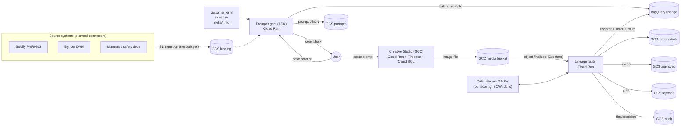

# How the Creative Asset Pipeline works

An explanation for someone new to the project: what happens from a user's request to an approved image, where every piece of data lands, and what isn't built yet. The examples come from the first live test on the SBD dev project (`sbd-cs-dev-kbhanoji`, Sep 27, 2026).

## 1. The big picture



Everything customer-specific is in `config/customers/<customer>/customer.yaml`: project, buckets, models, thresholds, SKUs, brand skills. The same code serves any customer.

## 2. Step by step (with the real test as the example)

### Step 1: The user asks the prompt agent for prompts
- The user opens the agent (`cap agent open` → http://localhost:8000) and asks: *"Create 2 hero-shot prompt variants for DCD800B, 1:1, 2K."*
- The agent (`agents/prompt_enrichment/agent.py`, Gemini 2.5 Flash) calls its tools:
  - `get_sku_context("DCD800B")` reads the product facts from `skus.csv`: name, category, features, reference images, parent asset ID.
  - `start_batch(["DCD800B"])` creates a **Batch Run ID**. It writes a `batch_run` row and a config snapshot (`gs://…-config/snapshots/<batch>/config.json`).
  - `save_enriched_prompt(...)`, once per variant, assigns a **Prompt ID** (`PR-…`), a **prompt family** (`PL-…`, which groups every version of the same SKU/shot/variant slot) and a **version** (v1, v2 … when revised). It writes:
    - an `enriched_prompt` row in BigQuery (text, SHA-256, SKU, shot type, aspect, resolution, skill versions, **created_by = the user**)
    - the prompt JSON at `gs://…-prompts/<brand>/<category>/<sub>/<sku>/<batch>/<PL-…>/v<n>/<PR-…>.json`
    - a `disposition` row: `CREATED`
- The agent shows one **copy block per variant**: the Creative Studio settings and the prompt alone in a code box.

Test: batch `BR-20260927-DWT-001`, prompts `PR-01M3HVBQ…` (variant 1) and `PR-01M3HVBS…` (variant 2), created by `kbhanoji@gmail.com`.

### Step 2: The user generates the image in Creative Studio
- Manual mode (the default, `generation.mode: manual`): the user pastes **one** prompt into Creative Studio and generates.
- Creative Studio saves the image to its media bucket (`gs://<project>-cs-development-bucket/gemini_images/<uuid>`). It keeps the prompt, user and model in its **own** database table `media_items`, not on the file.
- Automatic mode (`generation.mode: automatic`) skips this step: the pipeline calls the Gemini image model itself and continues at Step 4.

### Step 3: The file arrival triggers the lineage router
- An **Eventarc trigger** (`cap-creative-studio-finalized`) fires on "object finalized" in the GCC media bucket and calls the **lineage router** (`services/lineage_router/main.py`, Cloud Run, scales to zero).
- The router skips non-images and Creative Studio's `_thumbnail` copies.
- It tries to link the image to a Prompt ID, in order: a Prompt ID in the path/metadata → a prompt-text hash match → an unambiguous batch/SKU folder → otherwise **UNMATCHED** (the file is copied to the quarantine bucket).
- **Today, Creative Studio images arrive UNMATCHED**, because GCC keeps the prompt in its database, not on the file. An operator links them with `cap image link <GEN-id> <PR-id>` (we did this in the test). **Planned:** the router reads GCC's `media_items` row for the file (prompt, user, model) and links automatically.

### Step 4: Register the image (`Pipeline.register_image`, `cap/pipeline.py`)
- Assigns a **Generation ID** (`GEN-…`) and version 1. A revision of an existing image keeps the GEN ID and gets version n+1.
- Reads the **real pixel size**, copies the file to `gs://…-intermediate/<brand>/<cat>/<sub>/<sku>/<batch>/<GEN-…>/v1/<sku>_<shot>_<aspect>_<actual-res>_v1.<ext>`, and attaches GCS metadata (batch, prompt, generation, version, requested/actual resolution, `ai-generated=true`).
- Writes to BigQuery:
  - a `generation` row (links to prompt, prompt family, SKU, parent asset, batch; tool, match method, source URI, size)
  - an `edit_event` row: `REGISTER`
  - a `disposition` row: `PENDING_SCORE`

### Step 5: Score (`cap/scoring.py`)
- `scoring.provider: gemini_critic` (default) sends Gemini 2.5 Pro (`models.critic`):
  - the image
  - the generation prompt
  - the negative and safety constraints
  - the brand/safety **skills** (`skills/*.md`)
  - up to 4 **reference product images** (when the SKU has them)
- It asks for a 0–1 score on the four SOW 3.4.5 dimensions (with notes), a 0–100 hallucination risk, and a rationale, as structured JSON.
- The composite is a weighted average (`scoring.weights`: 0.35 / 0.35 / 0.20 / 0.10).
- Written to BigQuery `score` (all sub-scores, notes, weights and thresholds used, critic model, raw JSON) and to GCS metadata on the intermediate file (`composite-score`, `score-*`, `hallucination-*`, `critic-rationale`).
- `scoring.provider: gcc_endpoint` is a placeholder for Creative Studio's own critic. See Q3: the current GCC version has none.

### Step 6: Route (`cap/routing.py`, pure rules, all numbers in `scoring.thresholds`)

| Composite | Status | What happens |
|---|---|---|
| ≥ 85 | `APPROVED` (auto) | Copied to `gs://…-approved/…` with the scoring payload embedded in the file (PNG text chunk / JPEG comment) |
| 65–84 | `NEEDS_REVISION` | Stays in intermediate. A human revises the prompt (`revise_prompt` in the agent / `cap hitl revise`) → new prompt version → regenerate → v2 is scored again. Or the human approves as-is / rejects |
| < 65 | `FAILED_QC` (default) or `FLAGGED` | Copied to `gs://…-rejected/…` (FAIL) or held for mandatory review (FLAG) |
| HIGH hallucination risk (> 60) | `FLAGGED` | Never auto-approved, even at ≥ 85 |

Each decision writes a `disposition` row (append-only; the latest row is the current status). A final decision also writes an **audit package** (all versions, prompts, scores, edits, dispositions) to `gs://…-audit/…/audit-<timestamp>.json` (write-once bucket).

Test results:

| Prompt | Score | Path |
|---|---|---|
| Variant 1 (battery attached, but SKU is "Tool Only") | 85.75 | Auto-approved; the critic flagged the battery (prompt adherence 0.70) |
| Variant 2, image A | 100.0 | Auto-approved |
| Variant 2, image B (garbled belt-clip text) | 95.0 | Auto-approved |

### Step 7: Answering questions later
The BigQuery views and reports (`bigquery/views`, `bigquery/reports`) answer:
- `v_asset_lifecycle`: every image version with prompt, user, score, status, intermediate vs final
- `v_prompt_versions`: all prompt versions per SKU and the images each produced
- `v_user_activity` / report `02_counts_by_user`: who prompted what, and how many intermediate/final images
- `v_provenance` / report `05_provenance_for_parent`: everything derived from a source asset

```bash
cap status --sku DCD800B
cap report 01_who_prompted_what --user kbhanoji@gmail.com
```

## 3. Identifiers

| ID | Example | Created by | Meaning |
|---|---|---|---|
| Batch Run ID | `BR-20260927-DWT-001` | agent `start_batch` | One working session / run |
| Parent Asset ID | `SAL-4411872` | `skus.csv` (source system ID) | The source product record |
| Prompt family | `PL-01M3HVBQ…` | first save of a SKU/shot/variant slot | Groups all versions of one prompt |
| Prompt ID | `PR-01M3HVBQ…` | every prompt save | One prompt version |
| Generation ID | `GEN-01M3J1R8…` | first registration of an image | One image; versions v1, v2 … are its revisions |
| Event ID | `EV-…` | every write | Edit log / disposition / score row IDs |

## 4. Your questions

### Q1. Where are the source images for DCD800B? What was the prompt based on?
**There were none.** The DCD800B row in `config/customers/sbd-dewalt/skus.csv` has product text (name, category, three features) and an empty `reference_images` column. The parent asset ID `SAL-4411872` is a **placeholder** copied from the TDD example, not a real Salsify ID. So the prompt was written from that text plus the brand/safety skills, and the image model drew the drill from its general knowledge of DEWALT tools. That's why details like "Tool Only" vs. battery aren't enforced visually, and why the critic can't check the real product's shape.

To fix: fill `reference_images` with `gs://` URIs of real product images (ideally from the landing zone, Q2). They then flow to (a) the copy block (attach in Creative Studio), (b) automatic generation (sent to the image model), and (c) the critic (compared against).

### Q2. The landing zone is empty. How will it be populated from Salsify, Bynder, etc.?
The bucket (`gs://<prefix>-landing`) and the BigQuery registry table (`source_asset`) exist. The **ingestion service (S1 in the TDD) is not built yet**. The design (TDD 4.2) is one pattern for every source: **scheduled/on-demand batch pull → frozen snapshot in the landing bucket → registry row in BigQuery**. Agents never call source systems directly, which gives one set of credentials, reproducible lineage (hashed copies of exactly what was used), and protection from vendor rate limits.

Recommended implementation on GCP:

| Piece | Choice | Why |
|---|---|---|
| Connector runtime | **Cloud Run jobs** (Python), one per source (`ingest-salsify`, `ingest-bynder`, `ingest-docs`) | Batch, scales to zero, easy to test, same stack as the rest |
| Trigger | **Cloud Scheduler** (nightly/weekly) + on-demand from the agent (`start_batch`) or `cap ingest` | Matches the SOW's "scheduled and on-demand" |
| Orchestration (optional) | **Workflows** to run ingest → validate → notify | Retries and visibility without new infrastructure |
| Credentials | **Secret Manager** (Salsify API token, Bynder OAuth client/permanent token, Box JWT) | No secrets in code/config (TDD 15.3) |
| Network | Egress via **Cloud NAT with a static IP** (vendors can allow-list it), inside the VPC-SC perimeter | TDD 15.2 |
| Output | `landing/raw/<source>/<date>/…` (exact vendor payloads) → `landing/curated/<brand>/<cat>/<sub>/<sku>/…` (normalized `product.json`, images, manual extracts) + `source_asset` rows (SHA-256, source ID, completeness status, reason codes) | Lineage + completeness gate (missing fields → quarantine, TDD Risk 4) |

Per source:
- **Salsify PMR/GCI:** Salsify's REST API (products with properties, digital asset URLs), paginated with back-off on HTTP 429. Fallback: a scheduled Salsify channel/export (CSV/JSON) landing in a GCS drop folder. The connector maps Salsify properties → `skus.csv`-equivalent fields (category, sub-category, features, regional specs) and downloads the referenced images.
- **Bynder DAM:** Bynder's REST API (media search by metaproperties, derivative downloads) with an OAuth2 app. It provides product images (reference/gold), DAM guidelines and the background library. Bynder/Box **write-back** of final assets is a separate outbound service (A6), done later.
- **Manuals / safety docs** (Akamai NetStorage / Windows share, still to be confirmed): an API export or a scheduled file drop into `landing/manual/<source>/` with a `manifest.yaml`. Text extraction + Model Armor screening before any agent reads it.
- **Alternatives:** Google **Application Integration / Integration Connectors** offer prebuilt connectors for some SaaS systems. Check whether Salsify/Bynder/Box are covered in SBD's tenant before choosing; custom Cloud Run jobs work regardless. **Storage Transfer Service** suits large one-off or recurring bulk file copies (SFTP/HTTP/S3).

Next build step: `cap ingest` plus a first connector (a manual/CSV drop first, so SBD can hand over the 25 pilot SKUs and images before API access is granted), then Salsify, then Bynder.

### Q3. How do we get a score from GCC? The screen shows only the image.
**We don't. The scores come from our pipeline's own critic, not from Creative Studio.** Checked in the GCC `develop` code: its `media_items` table has a `critique` column, and the gallery's detail view shows a "Critique" box **if** that column is filled, but **no backend code fills it**. The "Gemini multimodal critic" described in the SOW isn't in this GCC version (an unmerged branch, `feature/brand-guidline-enforcement-eval`, may add it).

So the router scores every image with Gemini 2.5 Pro using the SOW 3.4.5 rubric and weights (Step 5). That's why nothing appears on the Creative Studio screen. To show scores to Creative Studio users, the options are:
1. **Write our score back into GCC:** set `media_items.critique` to "Score 95/100: APPROVED — rationale…" for the linked item. Their gallery then displays it with no UI change. This fits naturally with the planned `media_items` lookup (same database connection).
2. Use Creative Studio's critic once Google ships it (switch `scoring.provider: gcc_endpoint`).
3. A small results page / Looker Studio dashboard on the BigQuery views.

Recommendation: option 1 (plus 3 for reporting).

### Q4. Once there's an image and a score, how is it written to storage and BigQuery, and how are the events tied together?
See Section 2. In short: **Eventarc** (file finalized in the GCC bucket) → **lineage router** (Cloud Run) → `register_image` (copy to intermediate + `generation`/`edit_event`/`disposition` rows) → `score_and_route` (critic call → `score` row + GCS metadata → threshold rules → copy to approved/rejected + `disposition` row + audit package). The **IDs tie everything together**: every row and every GCS object carries the Batch Run ID, Prompt ID, Generation ID and version, and all GCS paths follow `<brand>/<category>/<subcategory>/<sku>/<batch>/<entity>/v<n>/`. In the test, linking and scoring ran through `cap image link` (same code path) because the images arrived UNMATCHED.

### Q5. Where do "gold standard" reference files go, and do we mention them in the prompt?
Two different things are often both called "reference", and they should be kept apart:

| Kind | What | Used for |
|---|---|---|
| **Product reference** | Real photos/renders of the exact SKU (Bynder/Salsify, KeyShot renders) | Product fidelity: shape, colours, labels, "tool only" vs kit |
| **Gold-standard exemplar** | Previously approved marketing images of the right style (per shot type/category) | Style: composition, lighting, background, crop |

Where to put them (landing zone, versioned, traceable):
- Product references: `gs://<prefix>-landing/curated/<brand>/<category>/<subcategory>/<sku>/reference/…`, listed per SKU in `skus.csv` → `reference_images` (already supported).
- Gold standards: `gs://<prefix>-landing/curated/<brand>/<category>/gold/<shot_type>/…`, registered per category/shot type. This needs a small addition: a `gold_standards` setting in the config, or a `gold_standard_images` column.

Do we tell the prompt? **Yes, but by attaching the images, with the prompt text saying how to use each one.** Image models (Gemini 3 Pro Image takes up to 14 reference images) follow attached images far better than descriptions. The enriched prompt should say, for example: *"Reproduce the product exactly as in reference image 1 (shape, colours, labels; no battery). Match the lighting and composition of style image 2; don't copy its product."*
- **Automatic mode:** the pipeline attaches them (product references already; gold standards after the addition).
- **Manual mode:** the copy block lists them and the user attaches them in Creative Studio's reference-image upload.
- **Critic:** it gets the product references today. With the addition it also gets the gold standard, with instructions to judge product accuracy against the product reference and style against the gold standard. This is what makes the score strict. (The 100/100 in the test was possible only because the critic had nothing real to compare against.)

## 5. Built vs. not built yet

| Area | Status |
|---|---|
| Prompt agent, prompt versioning, batch IDs | Built, tested live |
| Creative Studio (GCC) install, cost controls (scale-to-zero, DB auto-start/stop) | Built, tested live |
| Router: Eventarc pickup, thumbnail skip, registration, scoring, routing, audit | Built, tested live |
| Automatic linking of GCC images (read GCC `media_items`) | **Next**: images arrive UNMATCHED today |
| Score shown inside Creative Studio (write `media_items.critique`) | Proposed (Q3) |
| Ingestion connectors (Salsify, Bynder, documents) → landing zone | **Not built** (Q2) |
| Real SKU data and reference images for the 25 pilot SKUs | Waiting on SBD / ingestion |
| Gold-standard exemplars in prompts and critic | Proposed (Q5) |
| Product-accuracy gate for auto-approval | Decision for SBD (prompt adherence < 0.8 → revision) |
| Stage B (asset groups, Bynder/Box write-back) | Not built (tables exist) |
